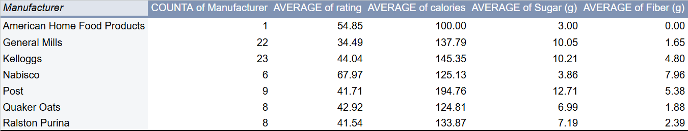
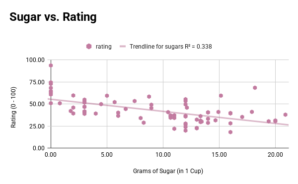
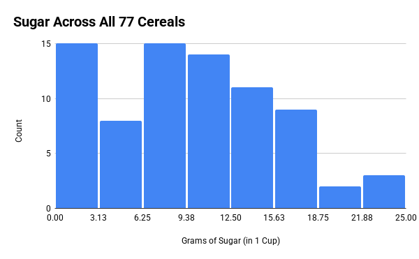
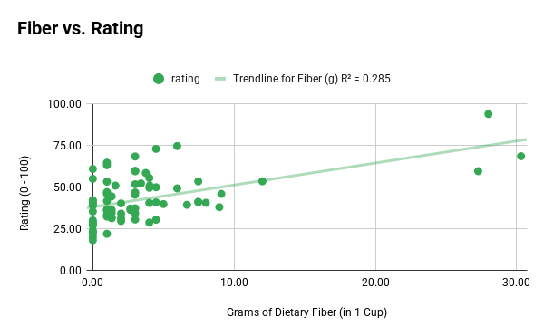
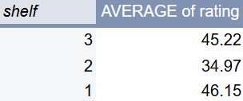
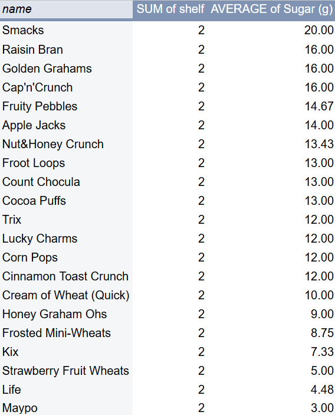

# Do We Really Prefer Sugary Cereals? What 77 Cereals Reveal About Our Breakfast Choices.

Cereal is a classic breakfast option in the United States, but everyone seems to approach this meal differently. Some eat it with milk first, in different sized bowls, and prefer certain brands. Cheerios, Fruit Loops, Cocoa Puffs, Frosted Flakes--the options are endless. Behind the playful branding, cereals vary widely in their nutritional profiles, especially in sugar and fiber, and these differences may influence how consumers perceive and rate them. Using a dataset containing 77 cereals, let's explore whether "healthier" cereals, that contain more fiber and less sugar, actually score better, and what the data reveals about trade-offs between nutrition, taste, and consumer preference.

## Where was this Dataset Obtained?
This dataset explores a common breakfast food that has become controversial due to how unhealthy it can be. Although not very large, it has the potential to reveal meaningful patterns in nutrition and consumer ratings.
The cereal dataset originates from [StatLib](https://lib.stat.cmu.edu/datasets/1993.expo/) and is a collection of nutritional information for 77 breakfast cereals sold in US grocery stores. It includes manufacturer codes, type (hot or cold), nutrition facts, and a rating number that is derived from consumer reports. 
This dataset CSV was obtained from the [Kaggle](https://www.kaggle.com/datasets/crawford/80-cereals/data) website. 

### This dataset is not perfect and there are some potential challenges. 
- Of the 77 cereals, several are missing nutritional information. The value `-1` appears as a placeholder in the data. 
- The rating system is not fully explained. It is likely a composite score, but the lack of information about how the rating came to be limits how strongly consumer preference can be interpreted. 
- This dataset was last edited in 2016, and therefore may not match the current era of products and nutritional standards.

## Data Analysis 
I used Google Sheets to access, organize, and visualize the dataset. You can find it [here](https://docs.google.com/spreadsheets/d/1Lk4DaioA_kUA9PnI-bP_J-3oBBLQC3fQtKKfhAiijvg/edit?usp=sharing).
This dataset can help us answer many questions:
- How are calories, sugar, and fiber distributed across cereals?
- Which cereals have the most extreme nutritional values?
- Is there a clear relationship between sugar and rating?
- Do high fiber cereals tend to have higher ratings than cereals with low fiber?
- Do manufacturers differ in average rating or nutritional profile?

### Do manufacturers differ in average rating or nutritional profile?
 
In this pivot table, we can see that manufacturers differ in average ratings and nutritional profiles. Nabisco stands out with the highest average rating of about 68 and the highest average fiber of nearly 8g. In contrast, General Mills and Kellogg’s, which produce a bulk of the most popular cereals, show lower average ratings (34 - 44) and higher average sugar levels around 10g. Post cereals have the highest average calories per cup, sitting just below 200 calories, and the highest average sugar levels. Lastly, Quaker Oats and Ralston Purina fall in the middle for both nutrition and ratings.
With this information, it seems like manufacturers who produce higher fiber, lower sugar cereals tend to have higher average ratings. On the other hand, brands with sweeter, calorie dense cereals generally score lower. However, this does not prove causation and only highlights the noticeable difference in how cereal companies produce their products nutritionally and how these choices may align with consumer ratings. We must also compare the values in this pivot with a grain of salt, since the overall number of cereal brands under each manufacturer is small. 

### Is there a clear relationship between sugar and rating?
 

*Scatterplot showcasing the relationship between sugar and rating of all 77 cereals. [Chart by: Asta Cheung - Source: [Kaggle](https://www.kaggle.com/datasets/crawford/80-cereals/data) - Created with Google Sheets]*

This is a scatter plot showcasing the relationship between Sugar and Rating for all 77 cereals. The trendline shows us that there is a negative correlation between grams of sugar and rating, meaning, as the amount of sugar decreases, the rating increases. However, it is important to note that the correlation is rather weak with an R^2 value of 0.338. So, while there is a relationship between sugar and rating, it is not strong enough to constitute predictions. 

### Let’s take a closer look at the distribution of sugar across all the cereal brands.
 

*Histogram showcasing the distribution of sugar across the 77 cereals. [Chart by: Asta Cheung - Source: [Kaggle](https://www.kaggle.com/datasets/crawford/80-cereals/data) - Created with Google Sheets]*

This histogram shows how sugar content per cup is distributed across all 77 cereals. A large cluster of cereals falls between approximately 0 - 3 grams of sugar per cup, with another significant group in the 6 - 9 gram range. Sugar levels beyond 12g see a huge drop. This uneven distribution helps us explain why the sugar and rating correlation in the previous chart is relatively weak. Most cereals have a narrow band of sugar values, leaving little variation for a strong linear relationship. 

### Do high fiber cereals tend to have higher ratings than cereals with low fiber?
 

*Scatterplot showcasing the relationship between the dietary fiber and rating of all 77 cereals. [Chart by: Asta Cheung - Source: [Kaggle](https://www.kaggle.com/datasets/crawford/80-cereals/data) - Created with Google Sheets]*

This scatter plot is similar to the last, but instead of comparing sugar and rating, we are looking at the relationship between fiber content and rating. The trendline shows us that there is a positive correlation between grams of fiber and rating. As the fiber content increases, rating also increases. However, just like the last chart, the R^2 value of 0.285 tells there is a weak correlation. Similar to what we saw with the sugar, this is likely due to the fact that the amount of fiber in the 77 cereals are not very diverse. A majority of the cereals have less than 10 grams of dietary fiber and only four cereals have over that amount, so it is hard to measure if there is truly a difference in rating between high and low fiber cereals. 

Given the weak linear relationship found in both scatterplots, we cannot make concrete predictions about rating using a change in sugar or fiber content. 

### Are these results associated with nutrition or popularity?
 
 

If we take a quick look at the average ratings for different shelf numbers, we can see that shelf 2 is noticeably less than shelf 1 and 3 (which are roughly the same). The cereal brands placed on shelf 2 are the most popular cereal brands in the US. For example, Cap'n'Crunch, Fruity Pebbles, Apple Jacks, Fruit Loops, Cocoa Puffs, Trix, Lucky Charms, and Cinnamon Toast Crunch are all well known brands. They also happen to have a higher sugar content. If we were to identify the brands on shelf 2 in the sugar distribution histogram, we’d notice that most of them fall in the three bins from 9.38g to 18.75g. 

This suggests two possibilities:
- The rating for each cereal takes the impact on health into consideration. According to the [American Heart Association](https://www.heart.org/en/healthy-living/healthy-eating/eat-smart/sugar/how-much-sugar-is-too-much), men should consume no more than 36g of sugar and women should consume no more than 25g of sugar in a day. Some of the brands on the second shelf contain nearly half the recommended sugar intake for both men and women in just one cup. Therefore, higher sugar might actually result in a decrease in rating score.
- The popular cereal brands receive a lower score because they are more likely to be bought and therefore rated. If there are more people buying these brands, there will be a larger number negative reviews that may tank the rating score.

But, because shelf placement is determined by store merchandising rather than nutrition, these patterns should be interpreted cautiously. 

## Methods and Limitations
### Methods
I imported cereal.csv into Google Sheets and cleaned it by replacing any `-1` values with blanks and checking for duplicate names. To make comparison between brands easier, I converted calories, protein, fat, sodium, fiber, complex carbohydrate, sugar, and potassium into grams and made sure they were all relative to one cup. 

### Limitations
The largest limitation of this dataset is missing information. The lack of a clear definition for the rating system means I cannot claim that the ratings perfectly reflect consumer preference. The demographic context is also vague so we don’t know who rated these cereals and under what conditions. 
Additionally, the sample size is rather small with only 77 cereals. The trends observed from this dataset might not necessarily reflect the true trends of real consumers, especially since this dataset was roughly put together between 1993 to 2016. It is possible that certain ratings are higher or lower than usual because of the varying amount of people contributing to their rating. 

## Ethical Concerns 
Since this dataset is both small and historical, it is dangerous to overstate health risks as it may unfairly target certain manufacturers. There are many confounding factors when it comes to health, therefore, high fiber and low sugar may not always constitute healthy food. Some factors directly related to food include: overall diet, portion size, and added benefits like vitamins and minerals. We also have to consider socioeconomic factors and business strategies such as, income, fresh food availability, marketing, pricing, and shelf placement. 

However, there are ways to add and strengthen what the dataset already reports. 
- Consulting or interviewing a dietitian or trusted nutritionist could help us interpret cereal labels and ratings better. 
- Conducting a supplemental survey to gather information about what consumers look for when they buy cereal (e.g., taste, price, health, etc.).
- Look into how differently “healthy” and “fun” cereals are marketed.
- Comparing this dataset with more recent nutritional data so that we can analyze what has changed.

## Conclusions
Overall, this dataset suggests that cereals with lower sugar and higher fiber tend to receive slightly higher ratings, but the relationships are weak and not predictive. The limited variation in nutritional values makes it difficult to draw strong conclusions about consumer preference. However, the analysis still highlights how nutrition, marketing, and popularity work together in shaping how cereals are perceived. With additional reporting and more recent data, this story could be expanded into a fuller picture of how Americans choose their breakfast foods.
